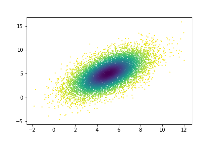

AI-IRW: Affine-Invariant Integrated Rank-Weighted depth
=========================================

This repository hosts Python code of the Affine-Invariant Integrated Rank-Weighted depth introduced in https://arxiv.org/abs/2106.11068.

Algorithm
---------

The AI-IRW depth belong to the family of data depth. It provides a score in [0,1] reflecting how deep (resp. far) an observation is w.r.t. a probability distribution. When computed on the entire dataset, it provides an ordering of the dataset.

Some parameters have to be set by the user: 

                                    - X: Array of shape (n_samples, n_features): the training set.
                                    
                                    - AI: bool
                                          if True, the affine-invariant version of irw is computed. 
                                          If False, the original irw is computed.

                                    - robust: bool, default=False
                                          if robust is true, the MCD estimator of the covariance matrix
                                          is performed.

                                    - n_dirs: int | None
                                          The number of random directions needed to approximate 
                                          the integral over the unit sphere.
                                          If None, n_dirs is set as 100 * n_features.

                                    - X_test: Array of shape (n_samples_test, n_features): the testing set. 
                                          If None, return the score of the training sample.

                                                                   

Quick Start :
------------

Create toy training and testing datasets:

.. code:: python

  >>> import numpy as np
  >>> import matplotlib.pyplot as plt
  >>> from aiirw import AI_IRW
  
  >>> np.random.seed(0)  
  >>> n_samples = 1000
  >>> n_samples_test = 1000
  >>> dim = 2
  >>> mu = np.zeros(dim)
  >>> sigma = np.identity(dim)
  
  >>> X_train = np.random.multivariate_normal(mu, sigma, n_samples)
  >>> X_test = np.random.multivariate_normal(mu, sigma, n_samples_test)
  
  
And then use AI-IRW to sort the dataset :  

.. code:: python

  >>> score_aiirw = AI_IRW(X, AI=True, robust=True, X_test=Y, n_dirs=1000)
  >>> rank_aiirw = np.argsort(score_aiirw)
  >>> colors = [cm.viridis_r(x) for x in np.linspace(0, 1, n_samples_test) ]
  >>> plt.scatter(Y[rank_aiirw, 0], Y[rank_aiirw, 1], s=10, c=colors, cmap='viridis')
  >>> plt.show()

The sorted simulated dataset, the darker the color, the deeper it is considered in the distribution.

Dependencies
------------

These are the dependencies to use AI-IRW:

* numpy 
* sklearn

Cite
----

If you use this code in your project, please cite::

  @article{staerman2021affine,
  title={Affine-Invariant Integrated Rank-Weighted Depth: Definition, Properties and Finite Sample Analysis},
  author={Staerman, Guillaume and Mozharovskyi, Pavlo and Cl{\'e}men{\c{c}}on, St{\'e}phan},
  journal={arXiv preprint arXiv:2106.11068},
  year={2021}
  }
